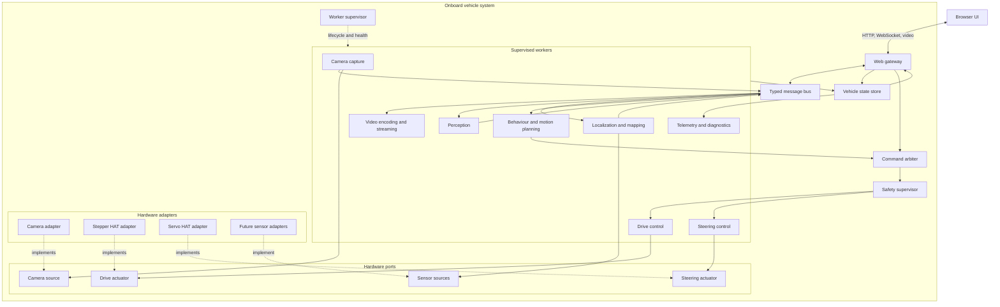
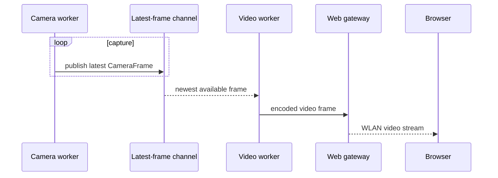
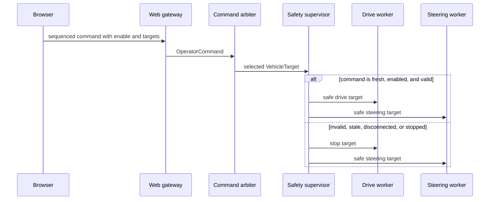
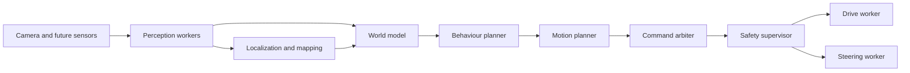
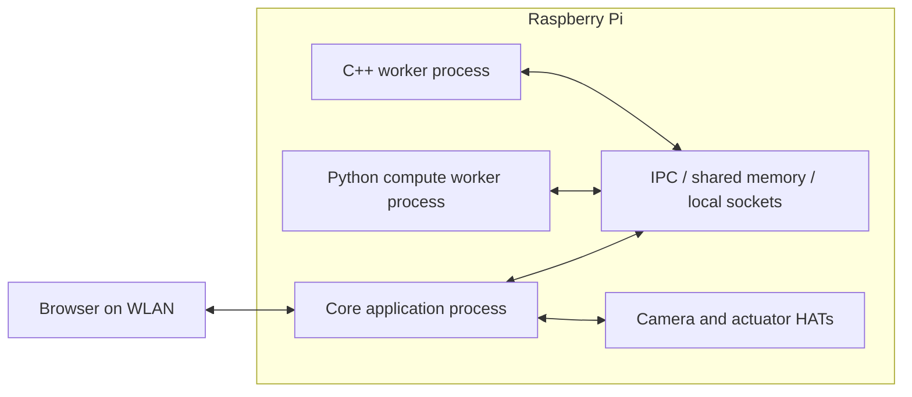

# Architecture

## 1. Purpose

This document defines the software architecture for turning a LEGO Technic car
into an autonomous indoor vehicle. The system is designed to grow through useful
milestones: live video, manual drive and steering, combined browser control,
perception, localization and mapping, navigation, and ultimately autonomous
driving.

The architecture describes stable responsibilities and boundaries. It does not
track implementation status and does not require all components to be deployed
from the beginning.

## 2. Drivers and constraints

### Primary goals

- Deliver useful vehicle capabilities incrementally.
- Keep camera, drive motor, steering actuator, and future sensors replaceable.
- Run camera capture, drive control, steering control, and other continuous work
  outside the web request path.
- Support threads, Python worker processes, and workers written in languages such
  as C++.
- Keep safety decisions local to the vehicle even when the browser disconnects.
- Allow compute hardware to change without changing the logical architecture.
- Make control and autonomy logic testable without physical hardware.

### Initial deployment constraints

- The onboard computer is a Raspberry Pi 3 Model B+.
- The operator connects using a browser over the local WLAN.
- Drive actuation uses a NEMA-17 stepper motor and a motor HAT.
- Steering uses a metal-gear servo and a servo HAT.
- The vehicle operates indoors.

These are deployment and adapter choices. They must not leak into planning,
control, UI, or autonomy contracts.

## 3. Architectural style

The system uses a **modular, message-driven architecture with ports and
adapters**.

- A modular application contains cohesive capabilities such as control, video,
  perception, localization, and planning.
- Workers own continuous or blocking work and communicate using typed messages.
- Ports define the capabilities the application needs.
- Adapters connect ports to specific hardware, libraries, network transports, or
  simulations.
- A supervisor owns worker lifecycle, health, and coordinated shutdown.
- A command arbiter and safety supervisor form the single path to actuation.

The initial deployment may be one Python application containing several worker
threads. CPU-intensive components can be moved to separate processes or C++
services without changing their logical inputs and outputs.



The message bus in this diagram is a logical abstraction. Inside one process it
can use bounded in-memory channels. Across processes it can use an IPC transport.
It is not intended to become a global, untyped event bus.

## 4. System boundaries

### Browser UI

The browser is an operator console. It:

- shows live video and vehicle state;
- sends drive, steering, stop, and mode commands;
- displays connection, worker, and fault status;
- provides explicit controls for enabling motion and emergency stopping.

The browser must never directly address hardware adapters. It communicates only
with the web gateway.

### Web gateway

The web gateway owns the WLAN-facing API. It:

- serves the browser application;
- authenticates a control session if authentication is enabled;
- validates transport-level input;
- converts UI messages into typed application commands;
- streams state and diagnostics to the UI;
- exposes the selected video transport.

HTTP is suitable for page assets and low-frequency operations. WebSocket is the
preferred channel for commands and telemetry because it supports bidirectional
updates and connection monitoring. The video transport remains replaceable;
MJPEG is a simple starting option, while WebRTC may be introduced if latency or
bandwidth demands it.

### Vehicle runtime

The vehicle runtime owns all workers, state, command routing, safety, and
hardware adapters. It must remain capable of stopping the vehicle when the UI or
WLAN connection is lost.

## 5. Worker and concurrency model

### Worker contract

Every long-running component implements a common lifecycle concept:

```text
Worker
  start()
  request_stop()
  join(timeout)
  health() -> WorkerHealth
```

Workers report at least `STARTING`, `RUNNING`, `DEGRADED`, `FAILED`, and
`STOPPED`. A worker must not create unmanaged child threads or processes. The
supervisor starts workers in dependency order, monitors them, and stops them in
reverse dependency order.

### Execution choices

Execution is chosen per workload, not per architectural component:

| Workload | Preferred execution |
| --- | --- |
| Camera and sensor I/O | Worker thread |
| Drive and steering control loops | Dedicated worker threads |
| Web server and network I/O | Async event loop or dedicated server thread |
| Video encoding | Thread, process, or hardware-assisted encoder |
| Object and lane detection | Worker process when CPU-bound |
| SLAM | Worker process or external C++ worker |
| Planning | Thread or process, depending on timing and load |
| Logging and telemetry export | Background worker thread |

Python threads are suitable for blocking I/O and periodic control. CPU-heavy
Python work should use processes to avoid the Global Interpreter Lock and to
isolate failures. A native C++ component can run in its own process and use the
same versioned message contract.

### Concurrency rules

1. **One owner per resource.** Only the camera worker calls its camera adapter;
   only the drive worker calls the drive adapter; only the steering worker calls
   the steering adapter.
2. **No shared mutable domain objects.** Workers exchange immutable messages or
   snapshots.
3. **Bound every channel.** No producer may create an unlimited backlog.
4. **Prefer fresh data.** Camera, control target, and state channels normally use
   latest-value semantics rather than processing stale queues.
5. **Preserve events.** Faults, mode changes, emergency stops, and lifecycle
   events use ordered event channels and must not be silently overwritten.
6. **Never block actuation on observation.** Video, UI, logs, and telemetry may
   drop updates; they may not delay a safety or control loop.
7. **Timestamp at the source.** Messages use monotonic timestamps for age,
   timeout, and latency calculations.
8. **Define deadlines.** Control messages carry an expiry time or maximum age.

### Channel types

The runtime provides a small set of explicit communication primitives:

- **latest-value channel:** one current frame, sensor sample, state, or target;
- **command mailbox:** the newest command for one consumer, with source and
  deadline;
- **event channel:** ordered, bounded delivery for faults and transitions;
- **request/reply:** infrequent actions such as configuration queries or a
  controlled calibration step.

Each channel has a named producer, named consumers, capacity, overflow policy,
message type, and delivery guarantees. Components must not exchange arbitrary
dictionaries.

## 6. Component responsibilities

### Worker supervisor

- constructs or receives all worker definitions;
- starts and stops the runtime deterministically;
- monitors heartbeats and worker failures;
- applies a declared restart or safe-stop policy;
- ensures hardware workers reach a safe state during shutdown.

### Camera capture worker

- owns one `CameraSource` instance;
- configures and starts the camera;
- captures and timestamps frames continuously;
- publishes the latest frame and capture statistics;
- reports camera failures and reconnect outcomes.

Additional cameras are additional worker instances with unique camera IDs. The
pipeline addresses frames by ID or role, such as `front`, rather than importing a
specific camera implementation.

### Video worker

- consumes camera frames without owning the camera;
- resizes, overlays, or encodes frames for browser delivery;
- limits output rate independently of camera capture;
- drops stale frames under load;
- reports client count, frame rate, and encoding latency.

Video and perception consume the same captured frame stream independently. A
slow browser must not reduce the perception or capture rate.

### Drive control worker

- is the sole owner of the `DriveActuator`;
- receives safe, bounded drive targets;
- refreshes the actuator at a defined control rate;
- applies acceleration and deceleration limits where configured;
- stops on command expiry, supervisor request, or adapter failure;
- publishes requested and applied drive state.

The initial stepper adapter translates generic signed drive targets into HAT
direction, step rate, enable, and stop behaviour.

### Steering control worker

- is the sole owner of the `SteeringActuator`;
- receives safe, bounded steering targets;
- applies position and rate limits;
- refreshes or releases the actuator according to its adapter contract;
- moves to the configured safe steering behaviour when stopped;
- publishes requested and applied steering state.

The initial servo adapter translates a normalized steering target into a
calibrated pulse width or HAT-specific command.

### Command arbiter

The command arbiter selects exactly one active control source:

- browser/manual control;
- an assisted-driving controller;
- the autonomous planner;
- calibration;
- emergency stop.

It rejects commands from inactive sources and emits a single `VehicleTarget`.
Control authority is explicit, observable, and changed only through validated
mode transitions.

### Safety supervisor

The safety supervisor validates the selected `VehicleTarget` before it reaches
the drive and steering workers. It enforces command age, enable state, speed and
steering limits, health prerequisites, and emergency-stop state. It emits a
`SafeVehicleTarget` or a stop target.

No control source may bypass the arbiter and safety supervisor.

### Perception workers

Perception is a pipeline of replaceable stages. Stages may include frame
preprocessing, lane detection, object detection, depth estimation, and sensor
fusion. Each stage declares input and output message types instead of depending
on a particular camera adapter.

Stages can be colocated or separated into processes. A slow stage works on the
newest suitable input and reports its output timestamp and confidence.

### Localization and mapping worker

The localization and mapping boundary accepts timestamped observations through
sensor-neutral contracts and publishes:

- a pose estimate with confidence and reference frame;
- map updates or a map snapshot identifier;
- tracking state and faults.

A visual SLAM, visual-inertial SLAM, LiDAR SLAM, or another implementation can
satisfy this boundary. The architecture therefore does not require a sensor
choice now. A future SLAM algorithm will impose minimum observation and timing
requirements, which belong in its adapter and deployment configuration.

### Planning workers

Planning is split conceptually into:

- **behaviour planning:** selects goals such as follow a lane, stop, avoid an
  obstacle, or navigate to a destination;
- **motion planning:** produces a safe intended trajectory or steering and speed
  target based on the world model and localization state.

Planning publishes commands through the command arbiter and never addresses
actuators directly.

### State, telemetry, and diagnostics

The vehicle state store keeps an immutable latest snapshot assembled from worker
updates. It is optimized for observation, not for issuing commands.

Telemetry publishes worker health, connection state, frame rates, latencies,
mode, faults, and requested versus applied actuator values. Logging and UI
consumers receive this information without becoming dependencies of control.

## 7. Ports and adapters

Ports use application-level semantics. Hardware-specific units stay inside
adapters.

### Hardware ports

```text
CameraSource
  open(configuration)
  capture() -> CameraFrame
  close()

DriveActuator
  enable()
  apply(DriveOutput)
  stop(StopMode)
  disable()
  status() -> ActuatorStatus

SteeringActuator
  enable()
  apply(SteeringOutput)
  stop(StopMode)
  disable()
  status() -> ActuatorStatus

SensorSource[T]
  open(configuration)
  read() -> SensorSample[T]
  close()
```

These are logical signatures, not a commitment to a particular Python interface
syntax. Their behavioural contracts must define lifecycle, units, error mapping,
thread affinity, idempotency, and stop semantics.

### Application ports

Stable boundaries are also defined for:

- command input;
- video output;
- telemetry output;
- clock access;
- perception stages;
- localization and mapping;
- map storage;
- configuration loading.

### Adapter selection

Bootstrap selects adapters from validated configuration:

```text
camera.front.adapter = picamera2
drive.adapter = stepper_hat
steering.adapter = servo_hat
```

Replacing a camera or motor adds an adapter and configuration. It does not
change the worker, browser API, safety supervisor, planner, or message contracts.

Hardware adapters must not contain driving policy. They may enforce final
electrical and mechanical bounds as defence in depth.

## 8. Core message contracts

Messages crossing worker boundaries are versioned and language-neutral where a
process boundary is possible. A schema technology can be selected later; the
contract matters more than its first serialization format.

| Message | Essential content |
| --- | --- |
| `CameraFrame` | Camera ID, sequence, monotonic capture time, image format, dimensions, and image data or shared-memory reference. |
| `OperatorCommand` | Session, sequence, monotonic receipt time, deadline, enable state, drive target, steering target, and stop request. |
| `VehicleTarget` | Command source, mode, sequence, deadline, drive target, and steering target. |
| `SafeVehicleTarget` | Validated target plus limits or safety reason applied. |
| `PerceptionObservation` | Source frame, observation type, geometry, confidence, and processing time. |
| `PoseEstimate` | Timestamp, coordinate frame, pose, covariance or confidence, and tracking state. |
| `MapUpdate` | Map identity, coordinate frame, revision, and changed data. |
| `WorkerHealth` | Worker identity, state, heartbeat time, metrics, and active fault. |
| `VehicleState` | Mode, control source, worker health, requested and applied actuation, perception/localization health, and faults. |
| `FaultEvent` | Stable code, severity, source, time, details, and required response. |

Normalized actuator targets use `[-1.0, 1.0]` at the manual-control boundary:

- drive: `-1.0` is maximum configured reverse, `0.0` is stopped, and `1.0` is
  maximum configured forward;
- steering: `-1.0` is the calibrated left limit, `0.0` is centre, and `1.0` is
  the calibrated right limit.

Adapters convert these values to steps per second, direction signals, servo
pulse width, or other device units. When closed-loop speed becomes available,
the internal drive contract may additionally use physical units such as metres
per second without changing the browser's normalized input contract.

## 9. Key runtime flows

### Camera stream to browser



### Manual vehicle control



The web gateway emits a disconnect event when its control connection closes.
Independently, command deadlines ensure that a lost connection results in a
local stop even if the disconnect event is delayed.

### Autonomous control



Manual and autonomous control share everything downstream of the command
arbiter. This prevents autonomy from creating an alternative, less-tested path
to the hardware.

## 10. Operating modes and control authority

The runtime has one explicit mode at a time:

| Mode | Control authority |
| --- | --- |
| `SAFE_STOP` | Safety supervisor; motion commands are rejected. |
| `MANUAL` | Browser operator through the command arbiter. |
| `ASSISTED` | Browser intent modified by an assistance component. |
| `AUTONOMOUS` | Behaviour and motion planners. |
| `CALIBRATION` | A restricted calibration workflow with explicit limits. |

Startup enters `SAFE_STOP`. A mode transition checks the required worker health,
configuration, calibration, and control connection. Any critical fault or
emergency stop returns control to `SAFE_STOP`.

Emergency stop is latched. Recovery requires an explicit reset after the cause
has been removed and health checks have passed.

## 11. Safety and failure handling

Software safety complements, but does not replace, a physical means of removing
motor power.

The following invariants apply:

- startup and shutdown do not cause unintended motion;
- only drive and steering workers access their actuators;
- every motion command has a source, sequence, timestamp, and deadline;
- expired or missing drive commands produce a stop;
- emergency stop overrides every mode and command source;
- UI, video, telemetry, and perception failures cannot block a stop command;
- a failed critical worker prevents or ends a moving mode;
- configured mechanical and electrical limits are enforced in both safety logic
  and hardware adapters where possible;
- requested, safety-limited, and applied commands remain observable.

Fault policy is declared per worker:

| Failure | Default response |
| --- | --- |
| Browser control disconnect in manual mode | Stop drive and enter `SAFE_STOP`. |
| Drive or steering worker failure | Emergency stop and disable actuators where supported. |
| Camera failure during manual operation | Report fault; manual motion policy is configurable. |
| Camera or required perception failure during autonomous operation | Stop and enter `SAFE_STOP`. |
| Video or telemetry failure | Degrade the service without blocking control. |
| SLAM tracking loss when localization is required | Stop or transition to an explicitly supported degraded behaviour. |
| Worker heartbeat timeout | Apply that worker's declared safe-state policy. |

The NEMA-17/HAT combination requires an explicit decision for coasting, holding,
decelerating, disabling coils, and power removal. The servo requires an explicit
decision for holding its last position, centring, or releasing torque. Those are
hardware safety contracts and calibration decisions, not generic assumptions.

## 12. Configuration and calibration

Configuration is loaded and validated before workers activate hardware. It
selects adapters and defines runtime settings such as:

- worker rates, deadlines, channel capacities, and restart policies;
- camera roles, resolution, frame rate, and pixel format;
- drive direction, maximum step rate, acceleration, and stop mode;
- steering centre, left/right limits, polarity, and rate limit;
- video encoding and WLAN endpoints;
- enabled perception, localization, and planning workers;
- safety limits and mode prerequisites.

Calibration is vehicle-specific data and is kept separate from general software
configuration. Missing or invalid safety-critical calibration prevents motion.

## 13. Deployment model

### Initial topology

The Raspberry Pi hosts:

- one application process with the supervisor, web gateway, state, command
  arbiter, safety supervisor, and I/O/control threads;
- optional Python worker processes for CPU-heavy pipelines;
- optional native worker processes for components such as SLAM.



Large image payloads should use shared memory or another zero/low-copy mechanism
when they cross processes. Control and state messages remain small and can use a
local socket or another versioned IPC transport.

### Changing compute hardware

Workers depend on ports and message contracts, not Raspberry Pi APIs. Moving to
another onboard computer changes deployment configuration and hardware adapters.
If the system is later distributed across computers, the same worker boundaries
can become network boundaries, but safety and final actuation remain onboard and
local to the vehicle.

## 14. Capability evolution

The architecture supports vertical milestones without introducing temporary
control paths:

| Milestone | Components exercised |
| --- | --- |
| Camera stream to browser | Camera worker, frame channel, video worker, and web gateway. |
| Speed control over UI | Browser commands, web gateway, arbiter, safety supervisor, drive worker, and drive adapter. |
| Steering control over UI | Browser commands, web gateway, arbiter, safety supervisor, steering worker, and steering adapter. |
| Full browser-operated car | Shared UI and state, video, coordinated drive/steering targets, connection watchdog, and telemetry. |
| Perception pipeline | Camera frame fan-out, perception workers, observations, metrics, and overlays. |
| SLAM | Observation contracts, localization/mapping worker, pose and map state, and tracking health. |
| Autonomous driving | World model, behaviour and motion planning, autonomous control authority, safety supervision, and existing actuator workers. |

Every milestone uses production boundaries that remain useful in later stages.
For example, browser and autonomous commands both enter the command arbiter, and
video and perception both consume the camera worker's output.

## 15. Suggested source organization

The physical layout follows capabilities while keeping contracts independent of
adapters:

```text
src/lego_car/
|-- contracts/          # Messages, units, faults, and port definitions
|-- runtime/            # Supervisor, worker lifecycle, channels, and IPC
|-- control/            # Modes, command arbiter, safety, drive, and steering
|-- camera/             # Camera worker and frame distribution
|-- video/              # Encoding and stream publication
|-- perception/         # Perception pipeline and stages
|-- localization/       # Localization and mapping boundary
|-- planning/           # World model, behaviour, and motion planning
|-- telemetry/          # State aggregation, diagnostics, and metrics
|-- web/                # Browser application and WLAN-facing API
|-- adapters/
|   |-- camera/
|   |-- drive/
|   |-- steering/
|   |-- sensors/
|   `-- simulation/
|-- configuration/      # Validated settings and calibration loading
`-- bootstrap.py        # Adapter selection and dependency wiring

protocols/              # Language-neutral schemas for process boundaries
```

This is a direction, not a requirement to create empty packages. Code should be
grouped when a capability is introduced and split further only when cohesion or
deployment requires it.

## 16. Verification strategy

- Port contract tests run against simulated and hardware adapters.
- Worker tests use fake channels, clocks, and adapters.
- Concurrency tests verify timeouts, queue overflow, shutdown, and worker failure.
- Recorded-frame tests exercise perception and SLAM deterministically.
- Integration tests run the complete manual-control path with simulated motors.
- Browser/API tests verify sequencing, validation, reconnects, and stale commands.
- Hardware-in-the-loop tests verify direction, limits, stop behaviour, and loss
  of communication with the vehicle physically restrained.
- Performance tests measure frame age, control-loop jitter, CPU/memory use, and
  end-to-end command latency on the target computer.

Simulation uses the same ports as hardware. It is not a separate implementation
of control, safety, or planning.

## 17. Architecture decisions to capture separately

The following details should be decided with small architecture decision records
when their capabilities are developed:

- in-process channel implementation and overflow policies;
- IPC and schema technology for Python/C++ workers;
- browser video transport;
- exact web API and command heartbeat frequency;
- stepper and servo safe-state behaviour;
- control-loop rates and Raspberry Pi performance budgets;
- process restart versus whole-application shutdown policies;
- image sharing across process boundaries;
- SLAM algorithm and required sensor set;
- map representation and persistence;
- authentication requirements on the local WLAN.

Those decisions refine the architecture without changing its central rule:
replaceable workers and adapters communicate through explicit contracts, and all
motion passes through one supervised safety path.
